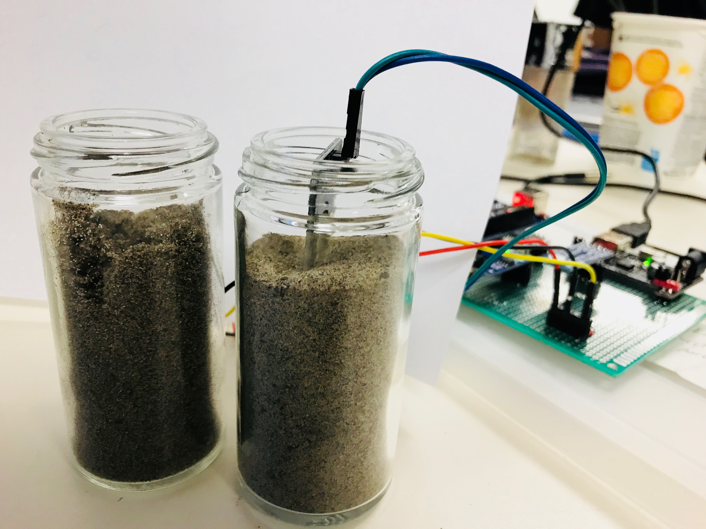

#  PLANT GROWTH MONITORING CAPSTONE PROJECT

This project represents the work of Bhavyasree, Darwin, and Selbin in creating a prototype Arduino setup that can monitor the luminosity, soil humidity and temperature.  This project contains sample code that allows the Arduino to interface with the light sensor, the thermometer, and the soil humidity measuring device.

#  CALIBRATION

Each of the peripherals was calibrated and tested in coniditions that are described in the calibration-tests directory.  A description of the calibrations tests from the photos is described below:

 Testing of LDR #1
			The testing of the LDR is done using the LUX meter, the light intensity is varied using the brightness controller in the class room
			
 Testing of the Temperature Sensor #2
			The Temperature sensor is a digital sensor which did not require any calibration the testing was conducted placing the sensor in ice and hot water.
			
			

	
 Testing of the Soil Humidity Sensor#3
			The testing of the soil humidity sensor is done using soil sample by changing the humidity by adding water.
			
			